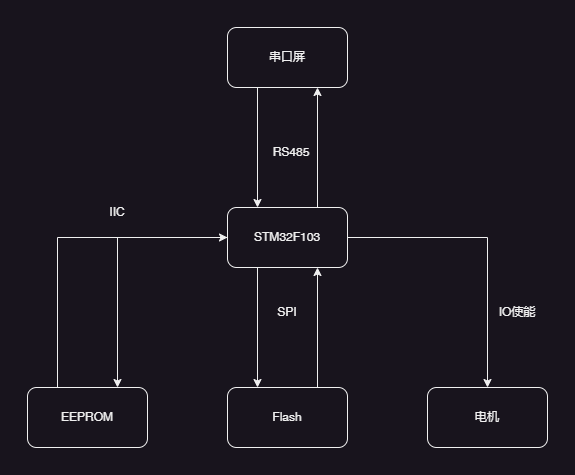
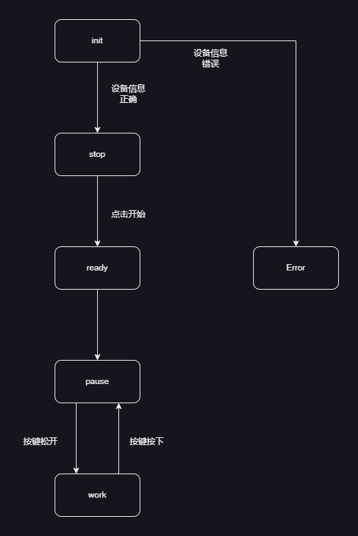
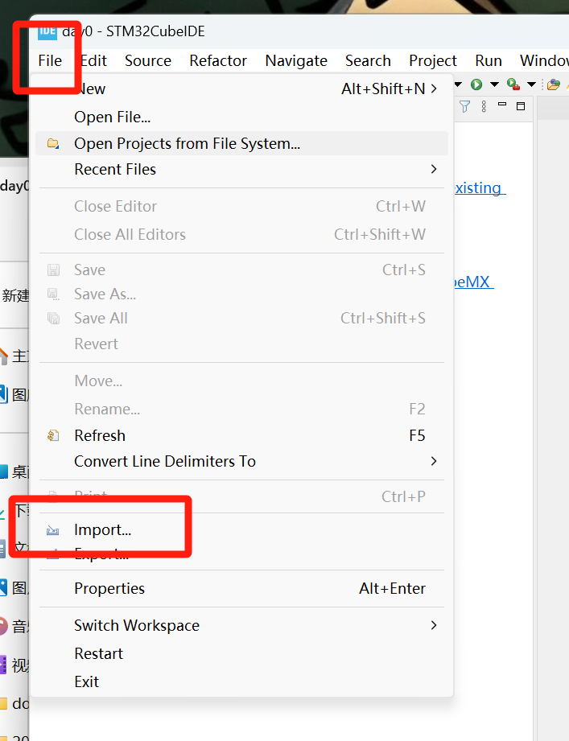

<h1 align = "center">系统测试方案</h1>

[TOC]

# 一、系统描述

## 1.1 系统概述		

该系统主要实现显示屏人机交互的功能，通过显示屏上点击按钮，MCU接收到指令后做出相应的反馈，从而实现系统的运行

## 1.2 系统框架

## 1.3 系统状态机

# 二、系统平台

1. GitHub: 代码更新提交平台，使用git更新代码
2. STM32CubeIDE-1.16.1
3. VisualTFT
4. 串口助手
5. CH340芯片驱动、帝特串口线驱动（只需首次连接时安装即可）

# 三、硬件连接

1. 电源连接

2. 烧录接口线连接

目前采用的SWD接口烧录，需要连接三根线

- SCLK: 时钟线
- SDIO：数据线
- GND：接地线
- 3.3V：电源线（此处不需要连接）

| j-link接口 | 开发板烧录引脚 |
| :--------: | :------------: |
|    SCLK    |      JTCK      |
|    SDIO    |      JTMS      |
|    GND     |      GND       |

3. DEBUG口信息打印接口连接：需要TTL转232串口连接线

- RX：接收数据，对应连接STM32F103串口的TX接口
- TX：发送数据，对应连接STM32F103串口的RX接口
- GND：接地，对应连接STM32F103串口的接地接口

4. RS485通信连接

- T/R+(A)：信号线，与开发板上485接口的A连接
- T/R-(B)：信号线，与开发板上485接口的B连接
- GND：接地线，与开发板上的接地线连接

# 四、系统测试准备

## 4.1 连接线序

按照第三部分内容连接好J-LINK、串口、RS485通信线

## 4.2 烧录代码

1. 使用git拉取代码
2. 打开STM32CubeIDE软件，工作控件选择项目代码的上一级

比如untitled是我的项目源码，我放在day0文件夹中，那么我的工作空间就选择day0

1中的路径选择上面的项目工程路径，例如此处的untitled

首先编译工程，确保项目代码编译没有错误

上电开发板，配置烧录器

控制台显示如下信息表明烧录成功，开发板断电

## 4.3 连接虚拟屏

1. 打开软件VisualTFT

2. 选择拉取的代码中.tftprj文件，点击打开

3. 运行虚拟屏

4. 串口号选择上述485通信的串口（可以通过插拔确定串口号），波特率为115200（这个是软件开发工程师配置驱动时编写好的），打开串口

## 4.4 打开串口助手

1. 打开软件sscom5.13，连接的串口为DEBUG，通过插拔的方式确定DEBUG口的串口号，波特率也是工程师配置好的115200，不勾选HEX显示（因为打印的信息都是字符串，不是十六进制编码），点击打开串口，后续测试的很多信息都需要在这里观察信息来判断是否正确

2. 测试485接口驱动时，也需要使用串口助手。串口为485通信口，波特率115200，勾选上HEX显示（此处通信使用的十六进制编码）。注意：此处打开的串口和虚拟屏的串口只能同时打开一个，如果同时打开会出现报错，测试驱动打开这里，完成测试就关闭，测试系统打开虚拟屏的串口，完成测试同样关闭串口。

# 五、系统测试

## 5.1 驱动测试

1. debug口测试：打开项目工程中的文件main.c，修改函数StartDefaultTask(void *)

连接好串口、烧录器，将代码更改成上述形式，上电，烧录程序，重启开发板，观察串口助手是否是每隔一秒打印一次“Hello, my name is Xiaoshuai!”。

2. 测试RS485通信

连接串口、连接485接口（此处使用串口助手连接测试驱动，连接方式参考4.4中）、烧录器，将代码更改成下述形式，上电，烧录程序，重启开发板，观察debug串口是否是一秒接收到一条指令0xEE, 0xB1, 0x00, 0x00, 0x00, 0xFF, 0xFC, 0xFF, 0xFF。通过485串口发送一条指令55 EE 03 00 00 03 49，观察debug串口是否接收到该指令。

3. LED灯测试

连接好串口、烧录器，找到StartLEDTask()函数，修改成下列形式，上电，烧录程序，观察开发板上的DS0和DS1是否每隔一秒闪烁一次，并且debug口是否打印test led的信息

## 5.2 系统测试

1. 连接好串口、烧录器、虚拟显示屏串口，将代码更改成下述形式

2. 上电，烧录程序，重新上电，观察LED灯是否一秒闪烁一次
3. 观察显示屏是否从开机切换到停止界面
4. 观察点击停止界面开始按钮，是否切换到准备界面
5. 观察准备界面没有出现问题的情况下是否自动进入暂停界面
6. 观察在暂停界面按下按键key0是否进入工作界面
7. 观察在工作界面松开按键key0是否进入暂停界面